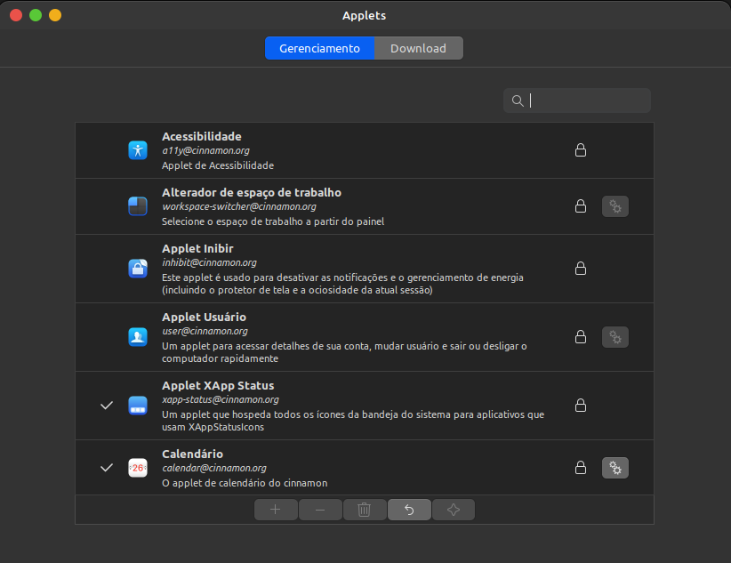
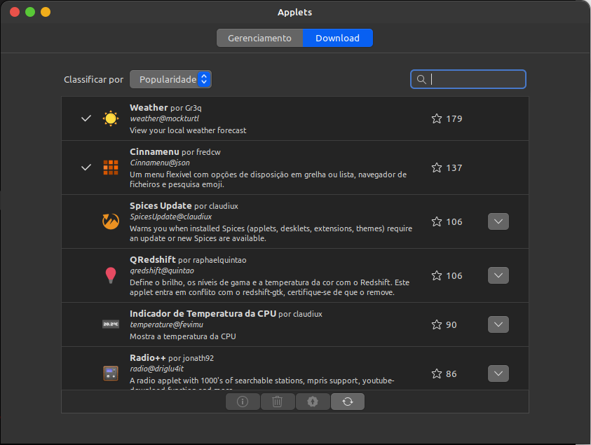

# Customizações no Linux Mint

Créditos ao [LinuxScoop](https://www.youtube.com/c/LinuxScoop), baseado no [vídeo](https://www.youtube.com/watch?v=DMs7DX3Um9E).

## Configurações Iniciais

### Janelas

Abra o Menu Iniciar >> Preferências >> Configurações do sistema >> Janelas


Deixe a disposição dos botões a esquerda:


É possível trocar a aparência do ALT + TAB, na aba Alt + Tab:


### Extensões

Abra o Menu Iniciar >> Preferências >> Configurações do sistema >> Extensões:


Na aba de Download, procure ou busque por Transparent panels e faça o download:


Após efetuar o download volte para a aba de 'Gerenciamento', selecione o 'Painéis transparentes', adicione pelo botão '+' e clique no botão de configurações:


Deixe o Tipo de tranparência como 'Semitransparente' e marque 'Usar os estilos do tema atual':


## Install Gtk Theme - Whitesur Gtk Theme Light/Dark

### Dependências
Instale as seguintes dependências:
```
sudo apt install sassc libglib2.0-dev-bin libglib2.0-dev libxml2-utils -y
```

### Instalar o tema
```
git clone https://github.com/vinceliuice/WhiteSur-gtk-theme.git ~/custom-theme/whitesur-gtk-theme
cd $HOME/custom-theme/whitesur-gtk-theme
./install.sh
```

### Instalar os icones
```
git clone https://github.com/vinceliuice/WhiteSur-icon-theme.git ~/custom-theme/whitesur-icon-theme
cd $HOME/custom-theme/whitesur-icon-theme
./install.sh
```

### Instalar o cursor
```
git clone https://github.com/vinceliuice/McMojave-cursors.git ~/custom-theme/mcmojave-cursors
cd $HOME/custom-theme/mcmojave-cursors
./install.sh
```

### Configurando o tema

Abra o Menu Iniciar >> Preferências >> Temas

Selecione icones >> WhiteSur-dark


Selecione aplicativos >> WhiteSur-Dark


Selecione Cursor do Mouse >> McMojave-cursors


Selecione Área de Trabalho >> WhiteSur-Dark


### Mudar a barra do menu

Clique com o botão direito do mouse no meio da barra >> Mover >> Selecione o top


Habilite o modo de edição do menu, clicando com botão direito do mouse >> Modo edição do painel


Remover a 'Lista de janelas agrupadas', clicando com o botão direito do mouse


Remover 'Mostrar àrea de trabalho', clicando com o botão direito do mouse


Remover o 'Menu', clicando com o botão direito do mouse


Adicionar Applets, clicando com o botão direito do mouse na opção 'Applets'



Na aba de Download, baixe os sequintes applets: Cinnamenu, Weather 



#### Configurando Cinnamenu

Na aba de gerenciamento dos applets, selecione o Cinnamenu e clique em +, vai ser adicionando na barra do Menu o icone


Arraste o icone para a esquesda


